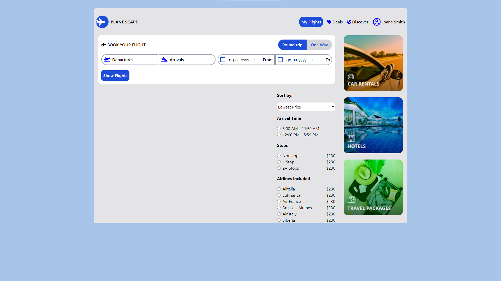
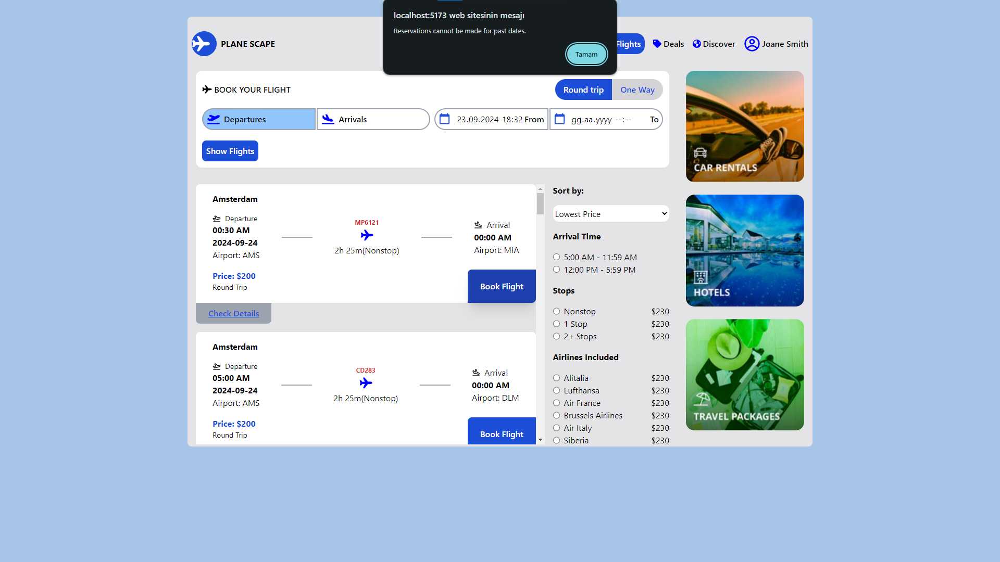
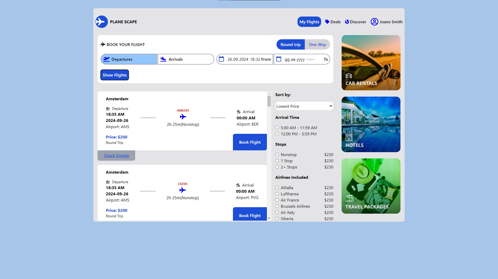
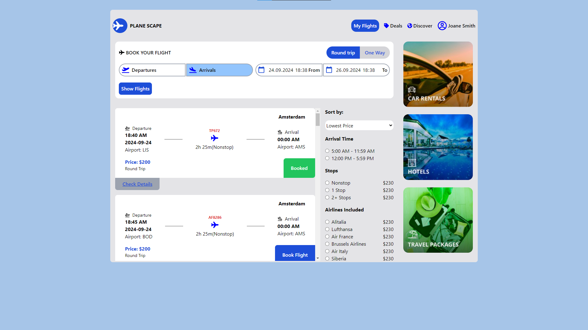
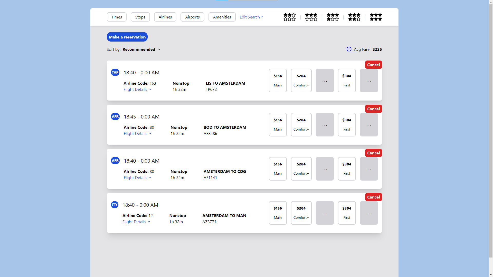

**Kurulum**

1. Deponun klonunu oluştur:
> git clone https://github.com/Sametcan7/pRojectDesktop.git

2. client dizininde bağımlılıkları indirmek için aşağıdaki kodu yaz;
> npm install
- Tamamlandıktan sonra uygulamayı başlatmak için aşağıdaki kodu yaz;
> npm run dev

3. server dizininde bağımlılıkları indirmek için aşağıdaki kodu yaz;
> npm install
- Tamamlandıktan sonra serveri başlatmak için aşağıdaki kodu yaz;
> nodemon index.js

 
 

 
 

 
 

 
 

